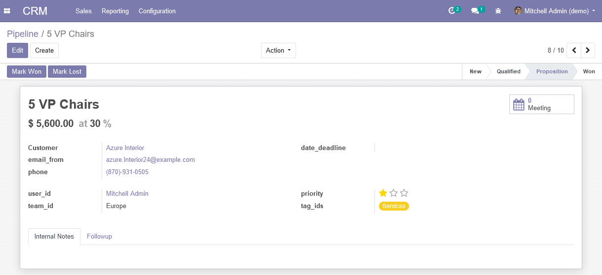

# odoo-debug-fieldsname
Replace fields label with fields name in views (for development purposes).

This should be more practical instead of "hovering" over each field with the debug/developer mode on.
Tooltips obviously remains available for more details (like domain, comodel, ...)

```
git clone https://github.com/fabiomix/odoo-debug-fieldsname.git -b 10.0 debug_fieldsname
```



## Configuration
1. add yourself in the 'Show fields name in views' group
2. activate Odoo debug mode

## Known issues / Roadmap
- replicate this feature on form header buttons
- string attribute overrides in xml views take priority over this functionality
